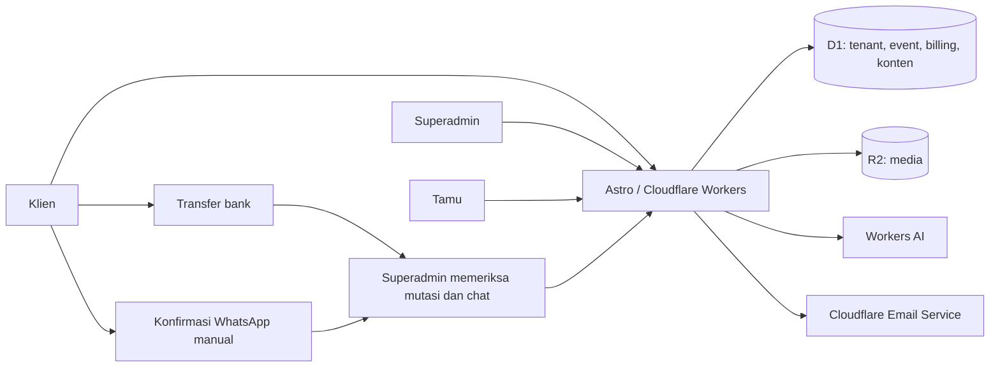

# Spesifikasi CELEYO — SaaS Digital Invitation

## 1. Status dan perubahan tujuan

**SPESIFIKASI BRAND/UI SIAP IMPLEMENTASI — BD1–BD3 TELAH DIKONFIRMASI.** Diperbarui 29 September 2026. Fondasi aplikasi, dashboard, API dan pengujian lokal sudah tersedia sebagaimana dicatat di [docs/IMPLEMENTATION.md](docs/IMPLEMENTATION.md); deployment dan verifikasi produksi belum dilakukan. Rencana terbaru menggunakan lima gambar pengguna sebagai acuan brand identity, logo, UI/UX dan design system. Cakupan final: pembaruan platform dan logo footer, rekonstruksi SVG dari gambar, serta desain/UX MVP wedding yang sudah ada. Gaya tiga template dan pilot Adam–Nadhila dipertahankan; Invitation Card dan unduh PNG ditunda. Bagian 16 menjadi acuan implementasi desain berikutnya. Pada revisi ini hanya `spec.md` yang diperbarui, tanpa perubahan kode atau aset aplikasi.

Tujuan baru adalah platform SaaS undangan digital: pengguna mendaftar, memilih jenis acara, memilih template, menyusun undangan lewat editor/chatbot, membeli paket dan memublikasikan undangan. Penyedia platform memakai dashboard superadmin. **Adam & Nadhila menjadi tenant/event pilot**, bukan identitas global aplikasi.

Dokumen ini menggantikan spesifikasi satu undangan sebelumnya. Larangan banyak pelanggan, registrasi publik dan pembayaran pada fase lama tidak berlaku. Pilihan terdahulu yang tetap berlaku: email/password, ucapan langsung tampil dengan moderasi setelah publikasi, kode unik per tamu, D1, R2, Workers, serta audio R2 dan YouTube dengan pemutar terlihat.

Peluncuran pertama hanya menyediakan **wedding invitation**, dengan pembayaran **sekali per event**: Starter Rp49.000/3 bulan, Premium Rp149.000/6 bulan, Signature Rp299.000/12 bulan. Klien transfer ke rekening bisnis penyedia dan **wajib mengonfirmasi lewat WhatsApp**; superadmin memeriksa konfirmasi serta mutasi bank sebelum aktivasi. Produk bersifat self-service dengan AI; jasa setup manusia dijual terpisah. Kategori lain, agensi/reseller dan gateway pembayaran berada di luar MVP.

### Identitas platform

| Elemen | Keputusan |
| --- | --- |
| Nama platform | **CELEYO**; gunakan penulisan ini pada identitas produk. |
| Tagline | **Create. Invite. Celebrate.** |
| Domain utama | **celeyo.com**; origin produksi kanonis `https://celeyo.com`. |
| Landing dan katalog | `https://celeyo.com/`. |
| Dashboard klien | `https://celeyo.com/app`. |
| Dashboard penyedia | `https://celeyo.com/superadmin`. |
| Undangan publik | `https://celeyo.com/i/{slug}`. |
| Pilot Adam & Nadhila | `https://celeyo.com/i/adam-nadhila`. |

Terapkan nama CELEYO pada landing, katalog, halaman akun, dashboard, invoice, identitas pengirim email aplikasi dan metadata platform. Tagline tampil utuh pada landing serta identitas pemasaran utama. Wordmark teks pada implementasi awal akan diganti dengan sistem logo simbol + wordmark + tagline dari referensi pengguna. Pembuatan aset logo dan penerapan visual mengikuti keputusan final pada bagian 16: rekonstruksi SVG dari referensi, penerapan pada platform dan logo footer, tanpa merombak gaya undangan. Bahasa antarmuka utama tetap Indonesia. Metadata undangan mengikuti pasangan/acara masing-masing, bukan judul global pilot.

Footer undangan Starter menampilkan tautan kecil **Dibuat dengan CELEYO** menuju `https://celeyo.com/`; Premium dan Signature mengikuti opsi menyembunyikan branding yang telah ditetapkan. Nama platform tidak menggantikan nama pasangan dalam desain undangan.

Nama dan domain adalah keputusan produk final. Kepemilikan domain, konfigurasi DNS/TLS, binding Workers dan verifikasi domain pengirim email harus dikonfirmasi saat setup produksi; dokumen ini tidak menyatakan semuanya sudah aktif.

## 2. Baseline dan pilot

Baseline sebelum migrasi berupa HTML/CSS/JavaScript statis, tanpa framework, backend, akun, database atau pembayaran. Versi tersebut disimpan di `legacy/`; implementasi CELEYO berada di `src/`. Form RSVP beratribut Netlify belum terbukti menyimpan data di produksi. Personalisasi `?to=`/`?guest=` hanya mengganti sapaan. Riwayat QA ada di `AUDIT-QA.md`; wording WhatsApp ada di `PANDUAN-UNDANGAN.md`.

| Data pilot | Nilai yang dipertahankan |
| --- | --- |
| Pasangan | Adam Alfiansyah S.H dan Nadhila Rachmawati, S.Psi. |
| Acara | Akad & Syukuran; Sabtu 26 Desember 2026, 09.00 WIB. |
| Lokasi | Kediaman Mempelai Wanita. |
| Alamat | Jl. Nilam II, No. 5, RT/RW 04/010, Jatiraden, Jatisampurna, Bekasi 17433. |
| Maps | https://maps.app.goo.gl/tYcqEJPrFE5dXKF79 |
| Instagram | @adam.alfiansyah dan @nadhilarchmwt. |
| Rekening | BCA 7401662727 dan BNI 1229896497; a.n. Nadhila Rachmawati. |
| Foto acara | `assets/gallery-6.webp`; tetap juga ada di galeri. |
| Musik | File pengguna `assets/paul-partohap-i-got-mine.mp3` sebagai audio R2 pilot. |
| Alamat lama | `adam-nadhila-wedding.pages.dev`, kelak diarahkan ke `https://celeyo.com/i/adam-nadhila`. |

Pertahankan cerita, nama orang tua, foto, gate, lightbox, clipboard, kalender, aksesibilitas dan tampilan yang disetujui. Jangan mengarang waktu selesai. Kalender memakai Asia/Jakarta; nomor rekening bertipe teks.

Template umum mengambil struktur desain pilot saja. Foto, nama, rekening, cerita pribadi dan musik pilot tidak otomatis menjadi aset demo atau katalog komersial. Demo memakai data fiktif dan aset yang boleh dipakai platform.

## 3. Peran dan alur pengguna

| Peran | Hak |
| --- | --- |
| Pengunjung | Melihat katalog/paket dan demo; mendaftar. |
| Klien owner | Mengelola workspace, event, paket, pembayaran, template, aset, AI, tamu dan publikasi miliknya. |
| Klien editor | Kolaborator terbatas pada event yang diberikan, jika termasuk paket; tidak mengatur billing/owner. |
| Tamu undangan | Membaca undangan aktif; kode/sesi memberi hak RSVP dan ucapan pada satu event. |
| Superadmin | Mengelola katalog, paket/version, tenant, transaksi, grant pilot, pembatasan akun, penggunaan dan dukungan yang diaudit. |

Alur: daftar email/password → verifikasi email → workspace → buat event wedding → pilih template → isi lewat form/AI → preview draf → pilih paket dan buat invoice → transfer bank → kirim konfirmasi melalui WhatsApp → superadmin memeriksa chat dan mutasi bank → aktivasi entitlement → klien publikasikan → tambah/impor tamu → bagikan link personal → pantau RSVP/ucapan.

Satu user dapat memiliki beberapa event; setiap pembelian awal berlaku untuk **satu event**, bukan seluruh akun. Keanggotaan workspace dan role event ditentukan server. Pendaftaran tidak dapat memilih role superadmin.

Free preview: satu draf selama 7 hari, 3 foto/maksimum 25 MB, 3 bantuan AI sesudah email terverifikasi, tanpa link undangan publik. Ketiga template boleh dipreview, tetapi publish memerlukan paket yang mengizinkan template terpilih. Demo katalog selalu tersedia tanpa memanggil AI. Kuota trial melekat pada akun, tidak kembali ketika draf dihapus.

## 4. Dashboard klien dan superadmin

### Dashboard klien

- Ringkasan event: masa aktif, kuota aset/tamu/AI, pembayaran, status draf/publik, undangan dibagikan, RSVP dan jumlah orang hadir.
- Wizard wedding/template, editor field, warna/font dari pilihan yang didukung, pengaturan musik, preview desktop/mobile, simpan draf dan publish.
- Chatbot Compose di samping preview; proposal perubahan dapat diterapkan/dibatalkan, dengan riwayat dan undo.
- Daftar tamu, kelompok, kuota hadir, impor/ekspor CSV, link berkode, rotasi/cabut kode, template pesan wa.me dan status kirim manual.
- RSVP dan ucapan publik; hide/unhide oleh klien, buka/tutup penerimaan, ekspor data miliknya.
- Media library khusus event; upload foto/audio, alt text, focal point, urutan galeri, status terpakai dan kapasitas.
- Billing: paket, invoice/status, upgrade, masa aktif, sisa AI, add-on serta riwayat.
- Akun/kolaborator sesuai entitlement, email/password, logout, permintaan hapus event dan ekspor data.

### Dashboard superadmin

- Ringkasan penjualan benar-benar dibayar, event aktif, aktivasi/perpanjangan, refund terkonfirmasi, biaya penggunaan dan konversi trial; jangan menyebut transaksi pending sebagai pendapatan.
- Kelola kategori/template/version: metadata, demo, tier, publikasi/retire. Template yang sudah dipakai dipin ke versi; update katalog tidak mengubah event klien diam-diam.
- Kelola paket/price version/kuota/add-on; perubahan berlaku untuk pembelian baru, bukan mengubah kontrak yang sudah dibayar.
- Tenant/account/event: status aktif/suspend, grant pilot atau kompensasi, penanganan penyalahgunaan, expiry dan audit.
- Pembayaran manual: daftar invoice, klaim sudah transfer, status konfirmasi WhatsApp, pencocokan mutasi bank, permintaan penjelasan dan approve/reject dengan audit. Klik WhatsApp atau screenshot saja tidak boleh mengubah invoice menjadi paid.
- AI/operasional: model yang diizinkan, pemakaian token/biaya, batas per tenant/global, kegagalan dan tombol mematikan AI tanpa mematikan undangan publik.
- Dukungan memakai akses yang tercatat beserta alasan dan durasi. Hindari impersonation diam-diam serta akses massal ke nomor WhatsApp/isi pesan pribadi.
- Tindakan sensitif superadmin memerlukan autentikasi ulang dan audit; sediakan TOTP MFA untuk superadmin sejak peluncuran.

UI berbahasa Indonesia, responsif, keyboard accessible, target sentuh minimum 44 px. List paginated; validasi server, loading/empty/error/expired/conflict tersedia.

## 5. Paket dan harga peluncuran

**Harga dipilih pengguna; kuota berikut ditetapkan untuk menyesuaikan harga yang lebih rendah.** Harga per event, sekali bayar. Masa aktif dan kuota harus terlihat sebelum invoice dibuat. Semua paket memakai transfer manual dan konfirmasi WhatsApp tanpa fee gateway dari platform.

| Batas/fitur | Starter | Premium | Signature |
| --- | --- | --- | --- |
| Harga | Rp49.000 | Rp149.000 | Rp299.000 |
| Masa aktif sejak publish pertama | 3 bulan | 6 bulan | 12 bulan |
| Record undangan personal | 150 | 500 | 1.500 |
| Foto tersimpan per event | 5 | 20 | 40 |
| Total media per event | 75 MB | 250 MB | 500 MB |
| Bantuan AI selama masa paket | 10 | 50 | 150 |
| Template saat peluncuran | Minimal Ivory | Ketiga template wedding | Ketiga template wedding |
| Kolaborator | Owner | Owner | Owner + 1 editor |
| Branding platform | Ada, kecil | Dapat disembunyikan | Dapat disembunyikan |
| Bantuan manusia | Panduan/support teknis | Support teknis | Prioritas support teknis, bukan desain tanpa batas |

Semua paket mencakup link personal/kode, RSVP, ucapan, WhatsApp click-to-chat, galeri, musik R2/YouTube, pengamanan, dan ekspor CSV. Tidak menjual keamanan sebagai fitur premium. Kuota foto mencakup file unik yang disimpan; varian optimasi tetap dihitung dalam storage. Catatan tamu arsip tetap memakai kuota selama disimpan.

Satu bantuan AI = satu permintaan pengguna yang menghasilkan jawaban/proposal valid; maksimum 3 pemanggilan model per bantuan, masing-masing dibatasi input 8.000/output 1.000 token. Kesalahan sistem tidak mengurangi kredit klien tetapi biaya provider tetap masuk ledger platform. Kelanjutan jawaban memerlukan tindakan pengguna, bukan loop AI bebas.

Add-on awal ditetapkan terpisah: **100 bantuan AI Rp19.000**, **perpanjangan 6 bulan Rp49.000**, dan **jasa setup Rp199.000** untuk mengisi satu event dari data/foto klien pada template yang tersedia, maksimum dua putaran revisi. Jasa setup tidak mencakup desain baru dari nol, pembuatan foto/video atau riset data acara. Semua memakai invoice dan verifikasi transfer/WhatsApp yang sama; harga add-on merupakan keputusan rancangan, bukan layanan yang sudah diterbitkan. Domain pribadi tidak termasuk dan belum dijual pada MVP.

Premium menjadi pilihan utama. Starter ditujukan untuk pelanggan mandiri melalui kanal organik/referral; Signature dibedakan lewat kapasitas, masa aktif dan kolaborator, tanpa menjanjikan koleksi desain yang belum ada. Biaya teknologi kecil tidak menghilangkan biaya template, support, pemasaran, pengembangan dan risiko refund. Hindari klaim unlimited atau aktif selamanya.

Sebagai pembanding terbatas, [halaman harga Invitio](https://www.invitio.co.id/pricing) yang diperiksa menampilkan Rp139.000, Rp299.000 dan Rp499.000. Fitur/masa aktif berbeda; ini hanya satu pembanding publik, bukan survei pasar atau bukti permintaan pada harga platform ini.

### Entitlement, upgrade, dan retensi

- Server menyimpan snapshot harga/kuota/version pada order; request client tidak menentukan jumlah tagihan atau hak fitur.
- Server memeriksa entitlement aktif, akses template, kuota aset/tamu dan field wajib pada setiap publish. Menyembunyikan tombol di UI saja tidak cukup; pemilihan template premium saat trial tidak memberi hak publikasi pada paket Starter.
- Paid membuka entitlement, tetapi publish tetap tindakan klien. Masa aktif dimulai saat publish pertama; batas aktivasi 90 hari setelah pembayaran disetujui superadmin, dijelaskan sebelum checkout. Jika belum publish, masa aktif otomatis mulai pada batas aktivasi agar penyimpanan tidak tak terbatas. Tanggal transfer dan approval disimpan terpisah; keterlambatan pemeriksaan tidak memundurkan jatah aktivasi ke tanggal transfer.
- Sebelum checkout, tampilkan perkiraan expiry berdasarkan tanggal rencana aktivasi dan apakah masa aktif mencakup tanggal acara. Periksa kembali saat publish; bila tanggal acara berada setelah expiry, minta penyesuaian paket/perpanjangan sebelum publikasi. Masa aktif dihitung sebagai bulan kalender dalam zona event, dengan tanggal akhir bulan yang tidak tersedia disesuaikan ke hari terakhir bulan tujuan.
- Upgrade satu event membayar selisih tier dalam price version pembelian awal: Starter → Premium Rp100.000, Premium → Signature Rp150.000, Starter → Signature Rp250.000. Invoice upgrade hanya ada satu yang terbuka per event; server memeriksa tier/version lagi ketika approval untuk mencegah dua upgrade paralel. Tidak ada downgrade/refund otomatis.
- Upgrade menaikkan batas tamu/media dan menambah selisih alokasi AI tier dasar, tanpa mengembalikan kredit yang sudah dipakai. Add-on AI tetap terpisah. Tanpa perpanjangan tambahan, masa aktif tier baru dihitung dari tanggal aktivasi semula. Jika sudah membeli perpanjangan, pertahankan seluruh masa yang telah dibayar dan tambahkan hanya selisih durasi tier (3 atau 6 bulan) pada expiry yang ada; upgrade tidak mereset aktivasi atau memendekkan expiry. Sebelum aktivasi pertama, cukup ubah durasi tier yang akan diaktifkan. Harga katalog baru tidak mengubah kontrak upgrade price version lama.
- Perpanjangan menambah 6 bulan dari tanggal yang lebih akhir antara expiry lama dan tanggal approval. AI tidak otomatis diisi ulang; kredit yang masih ada berlaku sampai expiry baru. Top-up 100 AI menambah saldo setelah approval dan mengikuti expiry event, tanpa memperpanjang masa aktif.
- Jasa setup hanya dapat dibeli untuk event yang memiliki paket berbayar atau bersamaan dengan paket. Order item jasa menghasilkan tiket pengerjaan terpisah, bukan hak tak terbatas. Klien memberi data/aset dan persetujuan akses event; akses tim tercatat dan berakhir saat selesai. Hasil disimpan sebagai draf; publish tetap oleh owner. Pekerjaan di luar satu event/template yang tersedia/dua revisi memerlukan penawaran baru sebelum dikerjakan.
- Saat expired, link publik dinonaktifkan dengan halaman netral, bukan langsung menghapus data. Klien memiliki masa tenggang 30 hari untuk ekspor/perpanjangan; setelah pemberitahuan, purge data pribadi/media event. Billing/audit disimpan terpisah sesuai kebijakan retensi yang ditetapkan sebelum peluncuran.
- Peringatan expiry H-14/H-7/H-1 lewat dashboard/email. Quota, saldo AI, dan reserve storage diperiksa atomik; beberapa tab/upload tidak boleh melampaui batas.
- Grant pilot Adam & Nadhila berupa entitlement tercatat, bukan pengecualian hardcoded pada akses atau billing.

## 6. Perkiraan biaya Cloudflare

Harga resmi dicek 29 September 2026. **Kurs Rp17.000/US$ adalah asumsi perencanaan, bukan kutipan kurs saat ini.** Kuota berikut berlaku pada account secara agregat, bukan diberikan ulang untuk setiap klien.

| Komponen | Tarif/acuan yang dipakai |
| --- | --- |
| Workers Paid | Minimum US$5/bulan; 10 juta request dan 30 juta CPU-ms termasuk. Kelebihan US$0,30/juta request dan US$0,02/juta CPU-ms. |
| D1 Paid | 25 miliar rows read, 50 juta rows written/bulan dan 5 GB termasuk; kelebihan US$0,001/juta read, US$1/juta write, US$0,75/GB-bulan. |
| R2 Standard | US$0,015/GB-bulan; 10 GB-bulan, 1 juta Class A dan 10 juta Class B gratis. Kelebihan A US$4,50/juta, B US$0,36/juta; egress internet gratis. |
| Workers AI | Kandidat Qwen3-30B-A3B-FP8: sekitar US$0,051/juta input token dan US$0,335/juta output token. Model lain bisa jauh lebih mahal. |
| Cloudflare Email Service | Pada Workers Paid: 3.000 email keluar/bulan termasuk, lalu US$0,35/1.000 email; layanan send masih diberi label beta. |
| Turnstile | Paket Free tersedia; gunakan pada domain platform untuk signup/login berisiko/trial, bukan membuat widget per event. |

Sumber tarif: [Workers](https://developers.cloudflare.com/workers/platform/pricing/), [D1](https://developers.cloudflare.com/d1/platform/pricing/), [R2](https://developers.cloudflare.com/r2/pricing/), [Workers AI](https://developers.cloudflare.com/workers-ai/platform/pricing/), [Email Service](https://developers.cloudflare.com/email-service/platform/pricing/), [Turnstile](https://developers.cloudflare.com/turnstile/plans/).

### Simulasi dasar bulanan

Asumsi:

- Media rata-rata 0,25 GB untuk setiap event yang **masih disimpan**, termasuk draf/masa tenggang; jumlah ini berbeda dari pesanan baru per bulan.
- Setiap pesanan baru memakai 100 pemanggilan model, rata-rata 5.000 input + 1.000 output token per panggilan, seluruh konteks/reasoning dihitung. Itu bukan 100 bantuan dengan masing-masing 3 panggilan.
- AI per pesanan = 0,5 juta × US$0,051 + 0,1 juta × US$0,335 = **US$0,059**, sekitar Rp1.003. Free allowance harian AI sengaja tidak dikurangkan agar estimasi tidak bergantung pemerataan trafik.
- Request Workers agregat termasuk HTML/API/media yang melewati kode: 250 ribu / 1 juta / 10 juta per bulan; CPU rata-rata asumsi 10 ms. Static Assets murni berbeda dari media R2 yang diproxy Worker.
- D1 tetap di bawah kuota baca/tulis/storage, R2 A/B dan outbound email tetap di bawah allowance pada tabel dasar. Ini asumsi model, bukan hasil load test; scan/index, backup, email tambahan dan abuse dapat menaikkan tagihan.

| Skenario | Pesanan baru/bulan | Event tersimpan | Workers | R2 storage | AI | Total dasar/bulan |
| --- | --- | --- | --- | --- | --- | --- |
| Pilot | 20 | 100 | US$5 | US$0,225 | US$1,18 | US$6,405 ≈ Rp108.885 |
| Awal bertumbuh | 100 | 600 | US$5 | US$2,10 | US$5,90 | US$13 ≈ Rp221.000 |
| Skala berikutnya | 1.000 | 6.000 | US$6,40 | US$22,35 | US$59 | US$87,75 ≈ Rp1.491.750 |

Anggaran kerja yang disarankan, lebih longgar daripada titik dasar: **Rp170–340 ribu**, **Rp350–700 ribu**, dan **Rp2–4,3 juta per bulan** untuk tiga skenario tersebut. Ini cadangan operasional usulan, bukan penawaran harga Cloudflare atau jaminan tagihan maksimal.

Jika rata-rata panggilan AI menjadi tiga kali lipat, komponen AI juga kira-kira tiga kali lipat; model yang lebih mahal, reasoning panjang, semua klien menghabiskan kredit Signature, upload besar dan pembacaan media berulang harus dihitung ulang. Kuota AI/storage, reserve budget dan alarm server wajib sebelum trial dibuka.

Biaya domain, biaya bank jika ada, pajak, marketing, pengembangan, pemeriksaan pembayaran lewat WhatsApp dan support manusia serta margin usaha **belum termasuk**. Gateway tidak digunakan pada MVP, sehingga tidak ada biaya gateway dalam model peluncuran. Pada contoh 100 pesanan, budget cloud Rp350–700 ribu berarti alokasi sekitar Rp3.500–7.000 per pesanan baru, dengan biaya pemeliharaan event lama sudah dicakup asumsi jumlah tersimpan.

### Ekonomi paket dengan pembayaran manual

Ilustrasi biaya per pesanan, bukan laba pasti. Reserve pemeriksaan transfer/WhatsApp Rp5.000 setara 6 menit pada biaya internal Rp50.000/jam; ukur waktu nyata pada pilot.

| Komponen ilustrasi | Starter | Premium | Signature |
| --- | --- | --- | --- |
| Harga jual | Rp49.000 | Rp149.000 | Rp299.000 |
| Alokasi Cloudflare | Rp5.000 | Rp5.000 | Rp7.000 |
| Pemeriksaan pembayaran/WhatsApp | Rp5.000 | Rp5.000 | Rp5.000 |
| Reserve support teknis | Rp5.000 | Rp15.000 | Rp25.000 |
| Asumsi biaya akuisisi | Rp0, organik/referral | Rp30.000 | Rp50.000 |
| Kontribusi sebelum biaya tetap/pajak/refund/diskon | **Rp34.000** | **Rp94.000** | **Rp212.000** |

Alokasi cloud tersebut mengasumsikan skala contoh 100 pesanan/bulan; bila hanya satu pesanan, biaya minimum account tidak bisa dibagi ke 100 klien. Starter dengan biaya akuisisi Rp30.000 hanya menyisakan Rp4.000 pada ilustrasi ini sebelum biaya tetap; karena itu jangan menjadikannya paket dengan iklan mahal atau pengerjaan manual termasuk harga.

Support dalam paket adalah bantuan penggunaan/masalah teknis. Pengisian seluruh konten dan revisi desain oleh tim memakai jasa setup terpisah. Untuk add-on setup Rp199.000, target internal waktu pengerjaan maksimal sekitar 2 jam pada biaya Rp50.000/jam memberi reserve tenaga Rp100.000; bila brief melebihi scope, berikan penawaran tambahan terlebih dahulu. Tidak menjanjikan revisi tanpa batas atau support manusia 24/7.

Simulasi cloud pada tabel sebelumnya tetap merupakan skenario kapasitas konservatif dengan rata-rata 100 pemanggilan model/pesanan lintas paket. Itu bukan hak 100 panggilan bagi setiap Starter: Starter dibatasi 10 bantuan × maksimum 3 panggilan, Premium 50 × 3, Signature 150 × 3. Evaluasi ulang rata-rata storage/token dan porsi paket setelah pilot.

## 7. Katalog template dan jenis acara

**MVP hanya wedding.** Schema menyimpan event_type agar dapat diperluas, tetapi pendaftaran/billing hanya menerima wedding. Kategori lain tidak tampil sebagai pilihan aktif atau produk yang bisa dibeli.

| Template peluncuran | Karakter | Field/modul utama |
| --- | --- | --- |
| Minimal Ivory | Ringkas, tipografi bersih, krem | Cover, profil, acara, Maps, RSVP, ucapan, gift opsional. |
| Botanical Bloom | Floral lembut, galeri dan dekorasi | Modul standar, cerita opsional, foto dan warna dari palet terkontrol. |
| Editorial Journey | Cerita bertahap seperti pilot | Hero, profil, bab cerita, acara, galeri, RSVP, gift, penutup. |

Ketiga template pada tabel harus tersedia pada peluncuran publik. Minimal Ivory adalah template Starter; Botanical Bloom dan Editorial Journey tersedia untuk Premium/Signature. Classic Gold, Modern Celebration, birthday, aqiqah/khitanan, engagement dan kategori lainnya merupakan pengembangan setelah MVP, tanpa janji tanggal atau hak otomatis untuk paket saat ini.

Template memiliki ID/version, jenis acara didukung, schema field, allowed sections, palet/font, default, tier dan demo. Klien dapat mengubah field, memilih aset, menyalakan/mematikan modul opsional dan menyusun urutan yang diizinkan. Template/theme disimpan sebagai konfigurasi, bukan HTML/CSS/JavaScript kiriman klien.

Versi renderer ditulis/review dalam repo dan diterbitkan lewat CI. Superadmin mengelola metadata/availability, bukan menjalankan upload executable dari dashboard. Event dipin ke versi tertentu; perpindahan template membuat preview dan mempertahankan field yang kompatibel, dengan penjelasan jika ada field yang tidak terpakai.

## 8. AI Compose berbasis template

Workers AI menjadi inference utama; kandidat awal `@cf/qwen/qwen3-30b-a3b-fp8` memiliki function calling menurut [dokumentasi model Cloudflare](https://developers.cloudflare.com/workers-ai/models/qwen3-30b-a3b-fp8/). Kualitas bahasa Indonesia, kepatuhan schema dan latensi harus diuji pada pilot; model/harga tidak disamakan dengan jaminan kualitas.

Alur contoh: klien memilih Editorial Journey → chatbot menanyakan nama/tanggal/lokasi → klien memberi brief → AI mengusulkan teks pembuka/cerita, tema warna dan pemetaan foto → preview menampilkan perubahan → klien memilih Terapkan → simpan draf → klien memublikasikan setelah paket aktif.

Kemampuan:

- Menjelaskan field yang belum lengkap, merapikan wording dan menyesuaikan nada formal/santai/religius berdasarkan permintaan.
- Memetakan informasi yang diberikan ke schema, menyarankan modul/warna/font yang tersedia, membuat caption dan template pesan WhatsApp.
- Memilih aset yang diunggah klien melalui ID yang dimiliki event; tidak mengakses media tenant lain.
- Menampilkan pertanyaan jika tanggal, alamat, nama, rekening atau jadwal belum tersedia; tidak mengarang fakta.
- Menyajikan proposal JSON tervalidasi, diff, preview, apply/undo; manual editor tetap dapat dipakai saat AI gagal atau kuota habis.

Batas:

- AI tidak menghasilkan atau mengeksekusi kode bebas, SQL, shell atau arbitrary iframe. Tidak menambah tool/dependency sendiri.
- Tools sempit seperti read_event_draft, list_template_fields, list_event_assets dan propose_draft_patch; server menetapkan tenant/event dari sesi, bukan dari model.
- AI tidak memublikasikan, mengirim WhatsApp/email, membeli paket, menyetujui pembayaran, mengganti role atau menghapus data atas inisiatif sendiri. Publish adalah aksi klien terpisah.
- Input pengguna, cerita dan teks aset adalah data tidak tepercaya, bukan instruksi yang dapat membuka hak superadmin. Tidak mengirim daftar tamu, nomor WhatsApp, kode undangan, password atau bukti pembayaran ke model untuk compose.
- Percakapan/proposal tersimpan per tenant/event; history diringkas dan dibatasi. Draft version diperiksa saat apply; konflik 409 meminta refresh.
- Budget dan kredit di-reserve atomik sebelum inference; idempotency mencegah retry menagih dua kali. Ledger merekam token aktual, model/version, biaya estimasi dan hasil; release reservation/refund kredit mengikuti status gagal.
- Maksimal satu proses compose aktif per event, tool loop maksimal 3, timeout dan limit token eksplisit. Ada limit per akun/IP, limit harian trial dan plafon biaya global. Saat batas tercapai AI berhenti, tetapi situs tamu tetap berjalan.
- Generate foto/video/voice tidak termasuk MVP. Katalog memakai aset berizin, dan klien mengunggah fotonya sendiri.

## 9. Arsitektur Cloudflare

Runtime, database, object storage, AI dan email aplikasi memakai Cloudflare. GitHub tetap repositori/CI. Transfer bank dilakukan klien di luar aplikasi; WhatsApp menjadi kanal konfirmasi manual. wa.me/WhatsApp, Maps dan YouTube tetap layanan eksternal yang telah dipilih. MVP tidak memakai SDK gateway, webhook pembayaran, WhatsApp Business API, bot, atau sinkronisasi chat.

Stack: **Astro + TypeScript**, adapter resmi Workers, React islands untuk editor/dashboard/chat; **Better Auth** email/password dengan D1. Satu deploy platform melayani semua tenant; tidak membuat Worker/repo/deployment baru per klien.



- Domain produksi utama `https://celeyo.com` menyediakan `/app`, `/superadmin` dan `/i/{slug}`; public slug unik global. Link personal `https://celeyo.com/i/{slug}?to={nama}&code={token}`; slug pilot `adam-nadhila`. Custom hostname per klien ditunda.
- Konfigurasi origin produksi (`PUBLIC_SITE_URL` dan `BETTER_AUTH_URL`) memakai `https://celeyo.com`; trusted origins auth dibatasi ke origin environment terkait. Link verifikasi/reset, undangan dan metadata memakai origin dari konfigurasi server, bukan header Host yang tidak dipercaya. Origin lokal/staging terpisah. Canonical undangan memakai URL acara tanpa nama tamu atau kode; aturan noindex untuk halaman personal tetap berlaku.
- Email/password signup memakai Turnstile/rate limit, verifikasi email dan reset password one-time. Superadmin dibuat operator, bukan signup publik; MFA TOTP dan pemulihan terkontrol.
- [Email Sending Cloudflare](https://developers.cloudflare.com/email-service/get-started/send-emails/) memerlukan domain dengan Cloudflare DNS/onboarding pengirim. Uji ketersediaan layanan beta, quota dan deliverability pada account sebelum launch signup publik. Email Routing ke alamat terverifikasi saja tidak dianggap pengganti email transaksi ke semua klien.
- Cookie sesi Secure/HttpOnly/SameSite, origin/CSRF check, scrypt melalui library; reset/ganti password mencabut sesi. Hak superadmin/membership selalu diperiksa server.
- Satu D1 shared untuk MVP dengan tenant_id/event_id pada seluruh data domain; repository server mewajibkan scope. Composite FK/unique constraints mencegah relasi antar-tenant; jangan mengandalkan filter UI.
- Initial D1 shared dipantau ukuran dan beban. Batas database Paid terdokumentasi 10 GB; siapkan pemisahan database/retensi sebelum mendekati batas, bukan menunggu gagal. [Batas D1](https://developers.cloudflare.com/d1/platform/limits/).
- R2 object key dibuat server dengan prefix tenant/event/ID random. Prefix bukan otorisasi; akses download/upload/delete dicek terhadap membership dan visibility.
- Draft, billing, chat, tamu dan session no-store/private. Shared cache hanya untuk konten publik generik/aset dengan key event+version; personalisasi/kode tidak boleh bocor melalui cache.
- Status aktif/expiry/suspend event diperiksa sebelum menyajikan halaman publik dari cache; TTL konten dibatasi oleh sisa masa aktif. Invoice dan endpoint klaim hanya dapat diakses owner terkait, bukan editor event atau pemegang nomor invoice; approval hanya superadmin dengan autentikasi ulang.
- Tidak perlu Workers for Platforms, Vectorize atau Durable Objects pada MVP untuk template render dan chat turn terbatas. Tambahkan layanan Cloudflare baru hanya bila beban/fungsi terukur memerlukannya; biaya baru harus masuk model.
- Cron Worker menjalankan expiry/notifikasi/purge bertahap melalui job/outbox D1 yang idempotent. Pekerjaan tidak boleh bergantung pada tab klien tetap terbuka; queue terpisah dapat ditambahkan jika backlog meningkat.

### Model data utama

| Entitas | Cakupan dan tanggung jawab |
| --- | --- |
| users/auth sessions | Identitas global dari auth library; global role ditetapkan server. |
| tenants/tenant_memberships/event_memberships | Workspace dan owner, akses editor per event, membership/status; user dapat bergabung lebih dari satu workspace. Editor event tidak otomatis mendapat akses billing atau event lain. |
| event_types/templates/template_versions | Katalog global yang dibaca klien; hanya superadmin mengubah metadata publikasinya. |
| events | Tenant, jenis, slug, status, pinned template version, tanggal, published version, activation/expiry. |
| content_versions/content_assets | Draft/published JSON tervalidasi dan relasi aset per tenant/event. |
| guests/invitation_tokens/guest_sessions | Nama/nomor privat, token digest/ciphertext, sesi tamu terkait tenant+event+guest. |
| rsvps/wishes/invitation_activity | Respons dan status pengiriman/pembukaan, unique per tenant/event/guest sesuai fungsi. |
| media_assets | R2 key, pemilik, ukuran/checksum/tipe, visibility, status dan relasi pemakaian. |
| plans/plan_versions/orders/order_items/payments | Harga integer rupiah/currency, snapshot paket/add-on dan rekening bisnis, invoice, manual payment status, transfer time dan approval audit. |
| entitlements/usage_reservations/usage_ledger | Hak event, masa aktif, batas tamu/media/AI, reserve/consume/release yang atomik; grant unik per order item. |
| setup_tickets/support_access | Order jasa, event, brief klien, status pengerjaan, jumlah revisi, izin akses tim/expiry dan catatan serah terima. |
| ai_conversations/ai_runs/proposals | Percakapan terbatas, usage token/model dan patch preview/version milik event. |
| payment_confirmations/bank_reconciliations | Klaim klien, konfirmasi WhatsApp yang benar-benar diterima, identitas mutasi bank unik, alasan pemeriksaan/penolakan dan reviewer. |
| jobs/outbox | Retry email/expiry/purge, notifikasi status order dan pekerjaan terjadwal idempotent; tidak ada webhook pembayaran MVP. |
| rate_limits/audit_events | Scope tenant/IP, expiry; catatan aksi superadmin dan owner tanpa secret/raw code. |

Gunakan prepared statements, batch atomik, FK, unique constraints dan index tenant/event pada setiap daftar. Route menerima event ID untuk lookup, tetapi menentukan tenant dari membership server. Export, pencarian, AI, background job, asset, billing dan token termasuk dalam uji isolasi.

## 10. Transfer bank dan konfirmasi WhatsApp

### Rekening dan kanal billing

- Platform memiliki rekening bisnis penerima dan nomor WhatsApp billing sendiri, dikonfigurasi superadmin dengan autentikasi ulang serta audit. **Rekening hadiah Adam & Nadhila bukan rekening pembayaran SaaS** dan tidak boleh otomatis dipakai saat bootstrap.
- Nomor WhatsApp billing memakai format internasional yang tervalidasi; bank, nomor rekening, pemilik, total dan batas bayar ditampilkan pada invoice. Order menyimpan snapshot instruksi transfer/version agar perubahan konfigurasi tidak mengalihkan invoice lama diam-diam.
- Nama bank, nomor rekening, pemilik dan nomor WhatsApp konkret diisi operator saat setup. Sampai valid, checkout live dinonaktifkan; lingkungan lokal/staging memakai data fiktif. Tidak menampilkan placeholder seolah rekening nyata.
- Total invoice berasal dari harga/kuantitas order item server dalam integer rupiah. Tidak menambahkan kode unik rupiah atau fee gateway tersembunyi. Biaya transfer yang mungkin dikenakan bank berada di luar nominal yang harus diterima platform.

### Alur klien

1. Klien memilih paket/add-on untuk event miliknya. Server membuat ID order internal random dan nomor invoice yang mudah disebut di WhatsApp, menyimpan tenant/event, item, price version, total IDR dan jatuh tempo 24 jam.
2. Halaman invoice menampilkan instruksi dan tombol salin rekening/nominal serta **Konfirmasi Pembayaran via WhatsApp**. Transfer dilakukan klien di aplikasi bank, bukan oleh platform.
3. Tombol membentuk `https://wa.me/<nomor_billing>?text=<pesan_invoice_ter-encode>`. Format pesan yang direncanakan:

   ```text
   Halo, saya ingin mengonfirmasi pembayaran undangan.
   Invoice: {nomor_invoice}
   Event: {judul_event}
   Paket/add-on: {ringkasan_item}
   Nominal invoice: {total_rupiah}
   Nama pengirim transfer: [isi nama]
   Waktu transfer: [isi waktu]
   Saya lampirkan bukti transfer pada chat ini. Mohon diperiksa.
   ```

4. Klien menekan Kirim di WhatsApp dan melampirkan bukti secara manual. wa.me hanya mengisi teks; tidak otomatis mengirim, melampirkan file, menerima chat atau membuktikan pembayaran.
5. Jika WhatsApp tidak terbuka, sediakan salin pesan dan nomor billing agar konfirmasi tetap dapat dikirim manual. Pesan tidak berisi password, kode tamu, daftar penerima atau link admin berakses khusus.
6. Di halaman invoice, aksi terpisah **Saya sudah transfer dan mengirim konfirmasi WhatsApp** mencatat klaim klien dan mengubah status menjadi pending_review. Aksi ini belum merupakan konfirmasi diterima admin atau paid.
7. Halaman menunjukkan Menunggu pemeriksaan admin, waktu klaim dan status terakhir. Status diperbarui dari server saat reload atau polling terbatas; tidak menjanjikan aktivasi instan. Klik WhatsApp saja hanya mencatat waktu tombol dibuka.
8. Tidak ada upload bukti transfer publik/ke AI. Bukti dikirim melalui WhatsApp sesuai pilihan pengguna; sistem menyimpan metadata rekonsiliasi minimum, bukan menyalin seluruh isi chat/media otomatis.

### Alur superadmin

- Superadmin membaca konfirmasi pada kanal WhatsApp bisnis, mencocokkan nomor invoice, identitas pengirim dan nominal, lalu memeriksa dana masuk pada mutasi bank.
- Form review memisahkan `client_claimed_at`, `whatsapp_received_at`, waktu transfer bank dan `approved_at`. Klaim klien tidak dapat mengisi field pemeriksaan admin.
- Approval mengharuskan penanda **konfirmasi WhatsApp diterima**, mutasi yang cocok, reference/identitas entry mutasi, jumlah terverifikasi, actor dan catatan. Nomor WhatsApp pengirim tidak harus sama dengan email/nomor akun; pembayaran atas nama keluarga dimungkinkan setelah dicocokkan manusia.
- Simpan identitas mutasi yang bisa dibedakan dari mutasi lain. Jika bank tidak memberikan reference, operator mencatat kombinasi detail tanggal/waktu, rekening tujuan, pengirim dan jumlah lalu memberi ID rekonsiliasi internal; duplikasi detail diperingatkan untuk ditinjau. Satu entry mutasi tidak dapat dialokasikan ke dua invoice.
- Screenshot, nama yang mirip, klik tombol, klaim client atau akses browser ke URL sukses tidak cukup untuk approve. Transfer kurang/lebih, tidak ditemukan atau identitas tidak cocok masuk needs_clarification dan diselesaikan dengan klien lewat WhatsApp; tidak mengubah total paket atau paid otomatis.
- Approval dan aktivasi order item dilakukan atomik/idempotent: satu payment terverifikasi per invoice, satu grant entitlement/AI/extension/tiket jasa per order item. Klik ulang atau dua admin bersamaan tidak boleh menggandakan masa aktif/kredit.
- Sukses approval menghasilkan status paid, receipt/status di dashboard dan notifikasi email melalui outbox. Gagal mengirim email tidak membatalkan pembayaran sah; retry email tidak mengulangi grant.
- Superadmin tetap dapat menemukan invoice lewat nomor yang diterima di WhatsApp meskipun klien belum menekan klaim pada website. Review manual tersebut tetap melewati pemeriksaan yang sama.

### Status dan kondisi khusus

| Status | Makna dan aturan |
| --- | --- |
| pending_transfer | Invoice terbit, belum ada klaim/pemeriksaan. Belum memberi entitlement. |
| pending_review | Ada klaim klien atau review dibuka superadmin; tunggu pemeriksaan chat dan mutasi. |
| needs_clarification | Ada ketidakcocokan; alasan aman ditampilkan pada owner, detail bank privat tetap terbatas. |
| paid | WhatsApp dan dana diverifikasi, order items diaplikasikan sekali. Owner dapat publish jika syarat lain terpenuhi. |
| expired / cancelled | Invoice belum disetujui berakhir/dibatalkan; tidak memberi hak. Bukan bukti bahwa tidak ada uang yang masuk. |
| refunded | Pengembalian manual benar-benar diverifikasi dan dicatat; hak terkait disesuaikan secara terkendali, tanpa hard delete otomatis. |

- Invoice pending_transfer melewati 24 jam menjadi expired. Pending_review tidak otomatis ditandai paid/ditutup ketika timer habis; tampil sebagai review terlambat untuk operator.
- Pembayaran terlanjur masuk ke invoice expired/cancelled memerlukan rekonsiliasi manual. Approval standar ditolak; operator dapat melakukan pengecualian expiry yang memerlukan autentikasi ulang, alasan dan audit, tetap memakai snapshot harga serta tenant/event yang sama. Jangan mengabaikan uang masuk atau mengaktifkan order berbeda secara diam-diam.
- Membuat invoice baru atau mengklik WhatsApp tidak memperpanjang trial. Penghapusan event ditahan selama pembayaran/review atau jasa setup masih perlu diselesaikan; ini tidak membuka tambahan kuota AI/media maupun publikasi.
- Refund diselesaikan operator melalui bank, bukan aksi transfer otomatis aplikasi. Catat nominal/reference/aktor hanya setelah pengembalian diverifikasi; cegah grant baru dari approval ulang order refunded.
- Kebijakan harga, masa aktif, proses pemeriksaan manual, scope jasa dan kebijakan refund yang diterbitkan penyedia harus terlihat sebelum transfer. Tidak mengasumsikan refund otomatis atau menjanjikan aturan pajak.
- QA memakai invoice, mutasi dan chat fiktif. Tidak ada gateway, webhook pembayaran, WhatsApp Business API, sinkronisasi pesan atau transfer nyata yang dijalankan sebagai bagian pengujian.

## 11. Fitur undangan yang dibawa ke SaaS

- Satu record tamu dapat mewakili individu/pasangan/keluarga; nama 1–80 karakter, WhatsApp opsional ternormalisasi internasional. Kuota hadir default 4, dapat diubah 1–20; hadir 1–kuota, tidak hadir 0.
- Kode random 32 byte, digest untuk lookup, AES-256-GCM ciphertext untuk salin ulang admin; associated data mengikat tenant/event/guest. Mengubah to/slug tidak memberi hak tamu event lain.
- GET/preview WhatsApp tidak memakai kode sekali habis atau menandai hadir/dibuka. Exchange setelah Buka Undangan membuat sesi guest HttpOnly terkait event, valid 7 hari; hapus code dari address bar setelah berhasil.
- Cabut/rotasi kode membatalkan sesi lama; form tanpa kode/sesi valid hanya membaca. Dua tab/sesi event berbeda tidak boleh saling menimpa jawaban.
- Satu RSVP dan satu ucapan per tamu/event; unique constraint/upsert dan version check mengatasi retry/paralel. Pesan 1–1.000 karakter teks biasa, langsung published; edit pesan hidden tetap hidden sampai owner menampilkannya.
- Feed publik tidak mengandung nomor, kode, daftar tamu lengkap, RSVP privat atau catatan. Paginasi dan escape HTML; rate limit tenant/guest/IP, honeypot dan payload limit berlaku server.
- wa.me membuka pesan yang telah diisi; klien tetap menekan Kirim. Status klik/manual sent/opened dibedakan; tidak ada delivery/read receipt otomatis.
- Upload JPEG/PNG/WebP maksimal 10 MiB/25 MP, MP3 maksimal 20 MiB serta kuota paket total; validasi signature/ukuran aktual. Key baru tiap versi, private preview, ETag/Range audio, dan cleanup upload gagal.
- Cegah penghapusan aset terpakai melalui validasi atomik terhadap publish. Demo platform dan media setiap tenant terpisah. Tidak otomatis meminjam musik berhak cipta milik pilot untuk klien lain.
- R2 audio mulai setelah interaksi, loop/pause/resume. YouTube memakai pemutar resmi terlihat, minimal 200 × 200 px, manual play dan pause saat panel ditutup; bukan ekstraksi/iframe tersembunyi. Satu sumber berbunyi, fallback MP3 opsional. [YouTube IFrame API](https://developers.google.com/youtube/iframe_api_reference).
- Private response no-store, CSP, strict-origin referrer, noindex personal/admin, redaksi URL/body/cookie/kode pada logs; tidak memasukkan data klien ke bundle atau demo katalog.
- Optimalkan foto dan halaman mobile; semua template wajib lulus 320/390/768/1024/1440 px, keyboard, fokus gate, lightbox, reduced motion dan kegagalan audio.

## 12. Deploy, migrasi pilot dan operasional

- GitHub Actions memakai CLOUDFLARE_API_TOKEN dan CLOUDFLARE_ACCOUNT_ID seperti rencana sebelumnya. Binding DB, MEDIA, AI, EMAIL dan secret auth/enkripsi/rate limit/Turnstile dipasang per environment; tidak dikirim lewat chat/source/client.
- Local/staging/prod terpisah. PR menjalankan npm ci, typecheck/lint/test/build tanpa secret produksi. Trusted main: checks, preflight, backup, migration additive, deploy dan smoke test. Serialisasi deploy; tidak mereset account/data pada seed ulang.
- Superadmin bootstrap satu kali; tenant/event pilot beserta grant entitlement melalui migration/seed idempotent. Map aset dan konten pilot ke slug `adam-nadhila`; jangan menaruh nama Adam & Nadhila sebagai default tenant baru.
- Pasang domain `celeyo.com` pada Workers melalui Cloudflare DNS dengan HTTPS. Domain produksi kanonis tetap `https://celeyo.com`; bila alias `www.celeyo.com` disediakan, arahkan ke origin kanonis dengan path/query tetap utuh. URL workers.dev menjadi alamat teknis/preview, bukan tautan utama yang dibagikan klien.
- Setelah pilot sehat di `https://celeyo.com/i/adam-nadhila`, Pages lama menjadi pengalih GET/HEAD ke URL tersebut, mempertahankan query termasuk `to`, `guest` dan `code` tanpa double-encode. 302 saat uji, 301 setelah valid; POST lama 410. Target tetap dari konfigurasi, bukan open redirect.
- Public launch memerlukan akses pengelolaan `celeyo.com`, DNS/TLS dan domain pengirim email terverifikasi, akun Cloudflare yang siap Email Sending/AI, rekening bisnis penerima dan nomor WhatsApp billing yang sudah diverifikasi operator. Identitas pengirim memakai CELEYO; alamat pengirim ditetapkan saat onboarding email. Ketiadaan konfigurasi live tidak menghalangi implementasi lokal tetapi tidak boleh dianggap QA produksi lulus.
- Backup D1/R2/key privat; uji restore staging, expiry/purge dan pemulihan akun. Key rotasi versioned; rollback code memperhatikan kompatibilitas migration.
- Meter penggunaan tenant/global, alert storage/CPU/AI, budget cap dan kill switch AI. Bila budget AI habis, editor manual dan undangan aktif tetap berjalan.
- Tidak membeli domain, mengaktifkan layanan berbayar, melakukan transfer, mengirim WhatsApp atau melakukan deployment pada tahap rencana ini.

## 13. Tahapan implementasi

Tahapan berikut adalah roadmap platform keseluruhan; status aktual implementasi tercatat pada `docs/IMPLEMENTATION.md`. Pekerjaan brand/UI yang baru disetujui mengikuti urutan khusus pada bagian 16.8 dan menggunakan fondasi yang sudah tersedia.

1. **Validasi pilot dan fondasi CELEYO.** Gunakan keputusan final S1–S4 dan B1; terapkan nama CELEYO, tagline Create. Invite. Celebrate. serta konfigurasi domain `celeyo.com`. Isi rekening bisnis/nomor WhatsApp billing saat setup, siapkan framework/Workers dan port renderer pilot. Verifikasi D1/R2, auth/password dan email/AI pada runtime yang dipakai.
2. **Identitas dan tenant.** Registrasi/verifikasi/reset, superadmin bootstrap/MFA, workspace/membership, event ownership, schema/index, audit/rate limits. Lulus uji silang dua tenant sebelum melanjutkan.
3. **Katalog dan editor.** Template/version/schema, wizard wedding, media R2/kuota, draft/preview/publish, migrasi pilot dan guest/RSVP/ucapan/wa.me.
4. **Paket dan pembayaran.** Implementasikan price version Rp49/149/299 ribu, invoice transfer, tombol dan pesan konfirmasi WhatsApp, klaim klien, rekonsiliasi bank, approval atomik/idempotent, entitlement/usage reserve, add-on, upgrade/expiry dan dashboard superadmin. Uji dengan bukti/data fiktif tanpa transfer atau pengiriman chat nyata.
5. **AI Compose.** Binding model, scoped tools, structured proposal, preview/apply/undo, token/budget limits, abuse protection dan evaluasi brief Indonesia; manual editor tetap berfungsi.
6. **QA dan peluncuran bertahap.** Isolasi, konfirmasi WhatsApp/approval berulang dan invoice kedaluwarsa, kuota paralel, regresi template, restore/migrasi, cost instrumentation, CI/CD. Jalankan pilot Adam & Nadhila lalu kelompok kecil klien; perbarui harga/batas berdasar penggunaan sebelum pembukaan umum.

## 14. Kriteria sukses

- Identitas platform konsisten memakai CELEYO dan tagline Create. Invite. Celebrate.; landing, akun, dashboard, invoice serta email tidak memakai Adam & Nadhila sebagai merek platform. Branding undangan mengikuti paket.
- Di produksi, landing dan dashboard tersedia pada `https://celeyo.com`; undangan pilot pada `https://celeyo.com/i/adam-nadhila`. Link aplikasi/auth memakai origin environment yang benar, canonical tidak memuat data tamu, dan pengalihan Pages mempertahankan personalisasi tanpa double-encode. Verifikasi DNS/TLS serta email produksi dilaporkan terpisah dari pemeriksaan lokal.
- Dua tenant dengan data mirip tidak dapat membaca/mengubah/export media, chat, tamu, invoice atau draf satu sama lain, termasuk melalui ID/slug/kode yang diubah.
- Klien berhasil signup/verifikasi/login/reset; tidak dapat memberikan role superadmin kepada diri sendiri. Superadmin sensitif menggunakan MFA/audit.
- Klien dapat membuat event wedding dari template yang tersedia, mengisi lewat form/AI, membayar Rp49/149/299 ribu sesuai invoice, mengonfirmasi lewat WhatsApp dan publish setelah approval tanpa perubahan kode per klien. Kategori non-wedding ditolak pada MVP.
- Semua fitur pilot serta tampilan yang telah disetujui terjaga; template umum tidak membawa data pribadi pilot.
- Harga/quota snapshot ditegakkan server: Starter Rp49.000/150 tamu/5 foto/75 MB/10 AI; Premium Rp149.000/500 tamu/20 foto/250 MB/50 AI; Signature Rp299.000/1.500 tamu/40 foto/500 MB/150 AI. Masa aktif 3/6/12 bulan. Upgrade/expiry dan upload/AI paralel tidak memberi entitlement atau pemakaian gratis yang tidak semestinya.
- Klik WhatsApp atau klaim sudah transfer tidak memberikan entitlement. Approval memerlukan konfirmasi WhatsApp yang diterima serta mutasi bank cocok; bukti salah, transfer kurang, invoice expired dan mutasi yang sudah dipakai ditangani tanpa auto-paid. Approval ganda/paralel hanya menghasilkan satu aktivasi, satu top-up, satu perpanjangan atau satu tiket jasa sesuai order item.
- Instruksi invoice dan tujuan wa.me memakai rekening/nomor bisnis platform, bukan rekening hadiah pilot atau input client. Nomor invoice, nama beremoji, tanda &, plus dan nominal ter-encode benar; fallback salin pesan/nomor tersedia.
- Jasa setup tidak termasuk biaya paket; akses tim hanya ke event yang dibeli/diizinkan, revision count dibatasi dua dan publish tetap owner. Kegagalan email setelah approval tidak menggandakan grant atau membatalkan pembayaran.
- AI menghasilkan patch sesuai schema/tenant, tidak mengarang fakta penting, tidak memublikasikan/membayar sendiri, dan gagal dengan aman saat output salah/timeout/budget habis.
- Kuota AI dibebankan sekali untuk hasil valid; biaya provider untuk retry/failure tetap tercatat. Tidak ada loop atau trial gratis tanpa batas.
- RSVP/ucapan retry tidak duplikat, kode event A gagal pada event B, hidden tidak muncul kembali akibat edit tamu, wa.me tidak mengklaim pengiriman otomatis.
- R2 upload/akses private/quota/delete race aman; audio/YouTube dan responsivitas/accessibility lulus.
- Masa aktif, notifikasi, perpanjangan, ekspor/tenggang/purge diuji; tidak ada janji forever tanpa pembiayaan.
- CI/CD tidak membocorkan secret atau menulis staging ke production; backup dapat dipulihkan. Angka penggunaan nyata dibandingkan model biaya sebelum memperbesar pemasaran.
- Hasil lokal/staging/produksi dilaporkan terpisah. Spec siap implementasi tidak menyatakan aplikasi, load test, pembayaran, pengiriman WhatsApp atau deployment sudah dilakukan.

## 15. Keputusan final dan kesiapan

| ID | Keputusan pengguna | Konsekuensi implementasi |
| --- | --- | --- |
| S1 | Wedding dahulu | Peluncuran memuat tiga template wedding; kategori lain belum dapat dibuat/dibeli. |
| S2 | Transfer bank manual; wajib konfirmasi lewat WhatsApp | Invoice + wa.me, klaim client, review chat/mutasi bank oleh superadmin, approval atomik; tanpa gateway/WhatsApp API. |
| S3 | Harga lebih murah: Rp49/149/299 ribu | Starter/Premium/Signature tetap sekali per event selama 3/6/12 bulan; kuota disesuaikan pada bagian 5. |
| S4 | Self-service + AI; jasa setup terpisah | Support teknis tetap tersedia, pengerjaan konten oleh tim menjadi add-on berlingkup jelas. |
| B1 | CELEYO; Create. Invite. Celebrate.; Celeyo.com | Identitas platform CELEYO dengan origin produksi `https://celeyo.com`; pilot pada `/i/adam-nadhila`. |

Keputusan inti S1–S4 serta nama, tagline dan domain platform tetap berlaku. Keputusan brand/UI BD1–BD3 telah dikonfirmasi pengguna pada bagian 16.10; tidak ada klarifikasi desain yang tertunda. Provisioning domain, rekening bisnis, nomor WhatsApp billing, alamat pengirim/email operator dan nilai secret diselesaikan pada tahap setup melalui mekanisme yang sesuai; kredensial tidak ditulis sebagai nilai nyata atau diminta lewat chat saat perencanaan.

**Spec platform dan addendum brand/UI siap menjadi acuan implementasi.** Implementasi awal dan akun uji lokal telah dibuat atas instruksi pengguna. Tidak ada pembelian layanan berbayar, pengiriman WhatsApp, transfer bank atau deployment produksi yang dilakukan. Keberhasilan lokal bukan pernyataan bahwa seluruh kriteria peluncuran produksi sudah terpenuhi.

Di luar MVP: kategori selain wedding, Invitation Card, unduh PNG undangan, gateway/webhook pembayaran, WhatsApp Business API/bulk send/sinkronisasi chat, arbitrary code generation oleh AI, AI foto/video, reseller, marketplace template pihak ketiga, custom domain per klien, native app, QR check-in dan pengelolaan acara di lokasi.

## 16. Addendum brand identity, UI/UX dan design system

**Status: DIIMPLEMENTASIKAN LOKAL — keputusan BD1–BD3 final.** Pengguna telah mengizinkan implementasi. Brand/UI diterapkan di workspace; hasil pengujian dan batas produksi dilaporkan pada `docs/IMPLEMENTATION.md` serta panduan `docs/brand/GUIDELINES.md`. Persyaratan bisnis, keamanan, harga, tenant dan infrastruktur dari bagian sebelumnya tetap berlaku. Perubahan mencakup platform dan logo footer; gaya undangan dipertahankan. Logo direkonstruksi sebagai SVG dari gambar. Invitation Card dan unduh PNG tidak termasuk pekerjaan ini.

### 16.1 Referensi dan interpretasi

Lima gambar yang diberikan pengguna menjadi sumber visual. Nama file berikut adalah identitas attachment; aset acuan belum disalin ke repository pada tahap perencanaan.

| ID | Referensi | Peran dalam rencana |
| --- | --- | --- |
| R1 | `img-3073491463.png`, board “OPTION 3 / SYMBOL LOGO” | Bentuk simbol, komposisi wordmark/tagline, varian logo dan nuansa brand. |
| R2 | `img-2140561159.png`, board Brand Identity / Visual System / Mobile & Web App | Hierarki UI, pasangan font Playfair Display + Inter, peran warna, landing, katalog, dashboard, editor dan tamu. |
| R3 | `img-4239343380.png`, Choose a Template / Make It Yours / Preview & Share | Alur mobile, pemilihan template, pengaturan desain, preview dan bagikan. |
| R4 | `img-55289375.png`, Share Your Invitation | Nuansa panel bagikan dan kejelasan aksi; fitur kartu dan integrasi pesan pada mockup tidak dibuat pada tahap ini. |
| R5 | `img-3481535377.png`, undangan / detail / RSVP | Konteks visual jangka panjang dan penempatan identitas brand; susunan serta desain halaman tamu saat ini dipertahankan. |

Gunakan R1 untuk geometri simbol dan R2 untuk tipografi serta struktur aplikasi; R3–R5 memperjelas penerapan di perangkat kecil. Warna antargambar sedikit berbeda karena ilustrasi, pencahayaan dan kompresi. Angka token pada bagian 16.4 ditetapkan sebagai baseline digital v1 dari sampling R2, bukan klaim pembacaan kode HEX asli. Rekonstruksi tidak bergantung pada pengiriman file master tambahan. Variasi warna foto/emboss pada mockup tidak menjadi varian master logo; gunakan palet flat yang konsisten.

Identitas yang dituju: hangat, tenang, personal dan elegan, dengan ivory dominan, forest untuk keterbacaan, terracotta sebagai aksen, serif pada pesan utama, ruang kosong cukup dan fotografi cahaya senja. Daun, bunga putih, lengkung arsitektur dan bayangan lembut menjadi aksen pemasaran; tabel, form dan panel operasional tetap jelas dan sederhana.

Mockup merupakan acuan desain. Tanggal, nama pasangan, angka statistik, harga, kategori acara dan ikon aplikasi pada gambar adalah contoh. UI aktual memakai data event serta entitlement yang benar. Bahasa produk tetap Indonesia; nama CELEYO dan tagline **Create. Invite. Celebrate.** dipertahankan.

### 16.2 Cakupan dan baseline

Baseline sebelum addendum ini memakai `platform.css` dengan burgundy `#723F4F`, Georgia/Arial, simbol huruf C dan favicon sementara. Rencana menggantinya pada landing, katalog, autentikasi, dashboard klien, editor/Compose, media, tamu, billing, akun, superadmin, empty/error states dan identitas platform pada email.

**BD1 final: platform + logo footer.** Seluruh platform mengikuti brand baru. Minimal Ivory, Botanical Bloom, Editorial Journey, demo, preview dan pilot Adam–Nadhila mempertahankan gaya serta renderer yang ada; pembaruan visual di halaman undangan dibatasi pada logo/lockup footer CELEYO sesuai paket. Tidak mengganti font undangan, palet template, cover/gate, urutan bagian, ornamen, komposisi foto, galeri, form RSVP atau kontrol musik. Data, foto, cerita, musik dan rekening hadiah pilot tetap sama. Thumbnail katalog menggambarkan template sebenarnya meskipun card dan halaman katalognya memakai design system baru.

**BD3 final: desain dan UX MVP wedding dahulu.** Perangkat pada referensi menggambarkan web responsif. Invitation Card, ekspor/unduh PNG undangan, PWA instalabel, aplikasi native, pengiriman otomatis, integrasi Instagram/Messages, reminder WhatsApp, kategori selain wedding dan kanvas desain bebas berada di luar tahap ini. Alur bagikan tetap memakai tautan web, salin link dan wa.me. Jangan menampilkan tab Card/Website, tombol Download, atau klaim fitur tertunda sebagai fungsi aktif. Asset PNG untuk favicon dan artwork sosial statis platform tetap termasuk paket brand; itu bukan fitur ekspor undangan klien.

### 16.3 Logo dan aset brand

- Simbol mengikuti kelopak/daun terbuka dengan garis pemisah ivory serta bintang empat ujung di atasnya; warna terracotta, sand dan forest mengikuti referensi. Geometri, orientasi, jarak antarbagian dan proporsi dijaga konsisten.
- Sediakan lockup horizontal, lockup bertumpuk dengan tagline, simbol tunggal, monokrom forest, versi ivory untuk latar gelap dan app icon. Wordmark selalu CELEYO dengan karakter serif serta tracking sesuai R1. Font wordmark bukan otomatis font judul UI; pada master SVG wordmark dapat berupa path agar proporsi tetap konsisten.
- **BD2 final: rekonstruksi SVG dari gambar.** Buat geometri simbol dan lockup vektor berdasarkan R1, termasuk varian yang diperlukan. Aset produksi berupa SVG bersih dengan `viewBox`, tanpa script, font eksternal, embedded photo atau foreignObject. Dokumentasikan sumber rekonstruksi dan bandingkan berdampingan dengan referensi. Wordmark yang dijadikan path berasal dari bentuk yang direkonstruksi atau font berlisensi sesuai; hasilnya tetap dapat disunting sebagai vektor.
- Clear space minimum 25% lebar simbol di sekeliling lockup. Ukuran minimum simbol 24 px dan lockup horizontal tanpa tagline 132 px. Tagline disertakan hanya saat tetap terbaca; pada header sempit gunakan varian tanpa tagline. Favicon 16/32 px mempunyai varian sederhana yang tetap dikenali.
- Jangan meregangkan, memutar, memberi efek emboss/drop shadow langsung pada master, mengganti bintang atau memakai huruf C lama sebagai substitusi. Pilih varian logo yang terbaca pada background; foto ramai membutuhkan panel ivory atau perlindungan kontras.
- Siapkan favicon SVG/ICO, PNG 32/180/192/512 px, logo untuk email, serta artwork sosial CELEYO 1200×630 tanpa data tamu. Ukuran app icon tidak berarti aplikasi native menjadi bagian MVP.
- Logo bertaut harus mempunyai nama aksesibel “CELEYO — beranda”; simbol duplikat di samping wordmark disembunyikan dari pembaca layar. Branding Starter tetap terlihat; Premium/Signature mengikuti pilihan hide branding.

### 16.4 Token warna, tipografi dan layout

Fondasi warna digital v1, disarikan dari R2 untuk implementasi ini:

| Token primitif | Nilai awal | Pemakaian |
| --- | --- | --- |
| `forest` | `#142C22` | Wordmark, judul, teks utama, area gelap. |
| `terracotta` | `#BC5538` | Aksen brand, CTA dan indikator pilihan. |
| `ivory` | `#FAF1E6` | Latar halaman hangat. |
| `sand` | `#E7CEB7` | Surface sekunder dan dekorasi ringan. |
| `sage` | `#818361` | Aksen sekunder dan ilustrasi pendukung. |

Pisahkan warna primitif dari token semantik. Baseline pasangan utama:

| Token semantik | Nilai | Aturan pemakaian |
| --- | --- | --- |
| `background` | `#FAF1E6` | Latar platform. |
| `surface` | `#FFFBF6` | Form, card dan panel yang ditinggikan. |
| `surface-subtle` | `#F1E4D5` | Pengelompokan sekunder. |
| `text-primary` | `#142C22` | Teks utama; sekitar 13,30:1 pada background. |
| `text-muted` | `#615D50` | Teks sekunder; sekitar 5,89:1 pada background. |
| `action-primary` / `on-action` | `#BC5538` / `#FFFFFF` | CTA terracotta dengan teks putih; sekitar 4,67:1. Jangan mengganti putih dengan ivory untuk teks kecil (sekitar 4,18:1). |
| `action-hover` | `#A64730` | Teks putih; sekitar 5,89:1. |
| `control-border` | `#867B69` | Batas kontrol pada surface; sekitar 4,04:1. |
| `focus` | `#142C22` | Outline dengan offset pada area terang; gunakan versi putih/ivory pada area gelap dengan kontras setara. |

Rasio di atas dihitung dari luminans relatif warna sRGB solid; opacity, foto dan overlay harus diuji ulang saat implementasi. Definisikan token tambahan untuk border dekoratif, pressed, disabled, selected, success, warning, danger dan info di panduan komponen dengan memenuhi target kontras. Turunan gelap/terang diperbolehkan untuk keterbacaan. Sage/sand tidak dipakai sebagai teks kecil tanpa pemeriksaan. Status dibedakan lewat label dan ikon selain warna.

- **Playfair Display** untuk judul pemasaran, headline dan judul emosional, dengan bobot normal/medium/semibold seperlunya. **Inter** untuk navigasi, form, tabel, tombol, body operasional dan angka. Kedua font dipasang lokal di Cloudflare assets dengan lisensi yang sesuai dan `font-display: swap`. Penerapannya hanya pada UI platform; font Cormorant Garamond/DM Sans yang dipakai undangan tetap tersedia dan tidak diganti.
- Token ukuran: display responsif 36–64 px, h1 aplikasi 28–36 px, h2 24–30 px, h3 18–22 px, body 16 px, teks tabel/sekunder 14 px, caption minimum 12 px. Input mobile minimum 16 px; line-height body sekitar 1,5. Judul dapat lebih rapat tanpa memotong diakritik atau nama panjang.
- Wordmark/tagline merupakan lockup brand; body tidak menggunakan letter spacing lebar dari wordmark. Teks harga dan statistik memakai tabular numerals. Semua nominal menggunakan format rupiah dari data billing.
- Spacing skala 4/8/12/16/24/32/48/64/96 px; radius kontrol 10–12 px, card 16–20 px, pill untuk chip. Shadow tipis digunakan untuk elevasi nyata seperti popover/modal; hindari bayangan besar pada setiap card.
- Marketing maksimal sekitar 1200 px dengan gutter 16 px mobile, 24 px tablet dan 32 px desktop. Aplikasi memakai sidebar desktop sekitar 240 px dan konten yang dapat menyusut; viewport sempit memakai navigasi ringkas/drawer. Breakpoint berbasis kebutuhan konten, acuan 640/960/1280 px.
- Elemen interaktif minimum 44×44 px. Sediakan focus ring terlihat, skip link, heading yang berurutan, label persisten, error terkait field, focus trap/return pada dialog, serta pengumuman loading/success/error yang relevan.
- Target kontras teks normal 4,5:1 dan teks besar 3:1; kontrol/focus/batas interaktif 3:1 terhadap area sekitar. Verifikasi seluruh state, termasuk selected, invalid, disabled dan foto latar. Animasi singkat sekitar 120–200 ms dan menghormati reduced motion; dekorasi tidak menghalangi interaksi.

### 16.5 Komponen dan state

Satu design system dipakai lintas halaman. Definisikan Button/LinkButton, IconButton, TextField/Textarea/Select, Checkbox/Radio/Switch, Tabs, Chip/Badge, Card/StatCard, Alert/Toast, Modal/Drawer, Pagination, DataTable, EmptyState, Skeleton, UploadZone/MediaCard, TemplateCard, Stepper, UsageMeter, InvoiceSummary, GuestSharePanel dan ComposeProposal/Diff.

Setiap komponen yang relevan mempunyai state default, hover, focus, pressed/selected, disabled, loading, error dan success. Empty state menjelaskan aksi berikutnya; expired, quota exhausted, pending payment dan version conflict memakai bahasa yang spesifik. Tombol destructive memerlukan konfirmasi sesuai tingkat dampak, tanpa mengulang konfirmasi untuk edit rutin. Loading tidak mengubah lebar tombol atau menutup pesan validasi.

Logo/brand bersumber dari aset yang sama pada Astro dan React. Ikon antarmuka memakai keluarga lucide-react yang sudah tersedia; ikon tidak menggantikan label untuk aksi yang mudah disalahpahami. Komponen tidak menyembunyikan informasi harga/masa aktif/kuota di dalam tooltip saja.

### 16.6 Persyaratan UI/UX per alur

| Area | Perubahan yang direncanakan | Perilaku yang harus jelas |
| --- | --- | --- |
| Landing | Hero ivory, lockup baru, headline serif, foto/dekorasi terarah, kartu template, paket dan alur kerja. | CTA utama membuat undangan; CTA sekunder melihat template. Tidak menampilkan statistik pelanggan atau testimoni fiktif sebagai fakta. |
| Katalog | Thumbnail konsisten, judul dan karakter template, penanda tier, preview mobile/desktop. | Minimal Ivory, Botanical Bloom dan Editorial Journey tetap menjadi tiga produk wedding; kategori lain tidak tampil sebagai filter aktif pada MVP. |
| Daftar/login | Form sederhana dengan identitas yang sama dan hierarki error jelas. | Verifikasi email, reset, MFA dan Turnstile tetap berfungsi; form tidak memuat dekorasi yang mengganggu pengisian. |
| Dashboard | Sapaan, daftar event, aksi membuat undangan/manual atau bantuan Compose, status dan kuota. | Angka berasal dari event aktual; unpaid/draft/published/expired dapat dibedakan, termasuk masa aktif dan tindakan berikutnya. |
| Editor | Panel bagian/konten, preview, pengaturan desain/media dan Compose dalam susunan responsif. | Desktop dapat memakai dua/tiga panel; mobile memilih mode Isi, Desain, Media, Compose atau Preview dan tidak memampatkan semua panel sekaligus. Draf belum disimpan ditandai; preview menjelaskan versi yang sedang ditampilkan. |
| Compose | Percakapan ringkas, brief, proposal dan diff dengan tombol Terapkan/Batalkan. | Tidak langsung mengubah halaman atau publish. Kuota/budget habis, output gagal dan konflik versi mempunyai recovery ke editor manual. Nama publik fitur tetap Compose. |
| Media/musik | Grid foto dengan pemakaian, kapasitas, progress upload, alt text/focus; pilihan audio R2/YouTube. | Alasan gagal upload terlihat. YouTube memakai pemutar terlihat; audio mengikuti interaksi pengguna dan mempunyai kontrol. |
| Tamu | Search/filter/grup, tabel desktop dan tampilan mobile yang bisa dibaca, impor/ekspor, kode dan share. | Jumlah tamu dan batas rombongan tidak tertukar; aksi salin link, WhatsApp dan pencabutan kode dapat dibedakan. Pencabutan menjelaskan dampak pada sesi tamu. |
| Preview/bagikan | Langkah periksa → publish → salin link/buka WhatsApp, meniru kejelasan R3/R4. | Status unpublished/unpaid mengarahkan pengguna ke langkah yang benar. Klik wa.me membuka aplikasi; tidak mengklaim pesan otomatis terkirim. Preview sosial publik tidak memuat nama/nomor/kode tamu. |
| Billing | Kartu paket dan ringkasan invoice dengan hierarki nominal, rekening, expiry dan status. | Konfirmasi WhatsApp serta klaim transfer dibedakan dari pembayaran yang telah disetujui. Tombol approve tetap memerlukan pemeriksaan operator. |
| Superadmin | Shell brand konsisten, tabel padat tetapi terbaca, filter dan panel review yang terstruktur. | Status pembayaran, grant, refund dan audit tetap jelas; MFA dan akses dukungan terbatas tidak dilemahkan demi desain. |
| Halaman tamu | Perbarui logo/lockup pada footer CELEYO yang sudah ada. | Pertahankan layout, font, warna dan perilaku cover/detail/galeri/RSVP/ucapan; Starter wajib branding, Premium/Signature mengikuti hide branding. Tidak ada penambahan langkah guest atau desain ulang form. |

Navigasi tidak boleh menghapus draf tanpa penjelasan. Aksi simpan, preview, publish dan bagikan berbeda secara visual dan istilah. Pada mobile, sticky action bar mempertimbangkan safe area, keyboard dan ruang untuk error; tombol submit tidak tertutup. Hindari membuka halaman eksternal tanpa interaksi pengguna.

### 16.7 Arsitektur implementasi desain

Tetap gunakan Astro, React, Workers, D1 dan R2 yang sudah ada. Pembaruan brand tidak memerlukan framework kedua atau pemindahan backend.

- `public/brand/`: SVG dan export raster logo, icon serta artwork sosial platform. `public/fonts/`: Playfair Display/Inter dan stylesheet pemuatan khusus platform beserta lisensi; pertahankan font serta stylesheet undangan yang sudah ada. `docs/brand/GUIDELINES.md` menjadi panduan penggunaan logo, token, komponen dan contoh; salinan referensi/sumber aset di `docs/brand/references/` disiapkan saat implementasi.
- `src/styles/tokens.css`: primitif dan token semantik brand; `platform.css` mengonsumsi token tersebut hanya dalam shell platform. Hapus nilai burgundy/logo lama dari area yang masuk cakupan. Jangan mengimpor stylesheet platform ke halaman/iframe undangan. Footer memakai aturan lokal bernamespace seperti `.celeyo-brand-footer` agar token dan selector global tidak menimpa renderer template.
- `src/components/ui/`: komponen React yang membutuhkan interaksi; wrapper Astro/static markup memakai token dan aset yang sama. Komponen BrandLogo/lockup lintas renderer membaca file master bersama agar tidak ada dua geometri logo berbeda.
- `Site.astro`, `AppShell.tsx`, landing/katalog/akun, `Dashboard.tsx`, `EventEditor.tsx`, `BillingPanel.tsx`, `SettingsPanel.tsx` dan `Admin.tsx` menjadi titik penerapan. Pada `Wedding.astro` dan `wedding.css`, perubahan dibatasi pada markup/gaya lokal footer brand serta impor aset yang dibutuhkannya. Preview/demo menggunakan renderer dan data yang sama; tidak ada migrasi versi template atau perubahan draft/published content untuk rebranding.
- Tambahkan halaman panduan brand/komponen untuk pengembangan dan review yang menampilkan logo, palet, tipografi serta state komponen. Lokasi `/dev/design-system` hanya aktif pada environment lokal; tidak memuat data pribadi atau menambah menu pengguna produksi.
- Aset brand statis dikirim lewat Cloudflare assets; aset milik event tetap R2 dengan aturan akses semula. Foto pada mockup tidak otomatis menjadi stok bebas pakai; gunakan aset pengguna dengan hak pemakaian yang jelas atau visual berlisensi. Foto pilot bukan materi pemasaran generik.
- Tidak menambah tabel/migrasi, endpoint ekspor PNG atau pipeline render kartu untuk pekerjaan desain ini. Kontrak API, scope tenant, status billing, kuota dan keamanan dipertahankan. Fitur kartu/PNG memerlukan spesifikasi tersendiri pada fase berikutnya.

### 16.8 Urutan implementasi

1. Catat baseline screenshot platform, tiga template dan pilot dengan data tetap; petakan komponen serta selector yang harus dipertahankan. Gunakan BD1–BD3 final dan palet digital v1. Inventaris aset/logo yang akan diganti tanpa mengubah data event.
2. Rekonstruksi SVG simbol/lockup dari R1, produksi varian/favicon, pasang font platform lokal serta token warna/typography/layout, lalu buat panduan brand dan halaman komponen. Verifikasi logo pada ukuran kecil dan warna pada semua state sebelum migrasi halaman.
3. Terapkan shell, landing, katalog, autentikasi dan akun; tinjau komposisi desktop/mobile terhadap R1–R3 dengan teks produk Indonesia.
4. Terapkan dashboard, editor/Compose, media, tamu, preview/bagikan, billing dan superadmin. Gunakan komponen yang sama, pertahankan kontrak API dan tambahkan perubahan UX tanpa kehilangan state.
5. Terapkan logo footer CELEYO pada renderer undangan, termasuk preview/demo, sesuai entitlement. Bandingkan tiga template dan pilot dengan baseline; perbedaan yang diizinkan pada halaman undangan hanya area footer branding.
6. Jalankan pemeriksaan otomatis dan visual; catat hasil, batas tersisa dan perbedaan yang disengaja terhadap mockup dalam panduan brand. Tidak melakukan deploy pada tahap perencanaan ini.

### 16.9 Kriteria sukses brand/UI

- Landing dan seluruh UI platform memakai simbol CELEYO, lockup, tagline, Playfair Display/Inter dan token yang konsisten; simbol C/burgundy lama tidak tersisa di UI platform. Footer undangan memakai logo baru tanpa mewariskan font/palet platform ke halaman undangan. Proporsi logo sesuai referensi dan seluruh export brand valid.
- Guideline mencakup penggunaan/logo yang keliru, clear space, minimum size, varian terang/gelap, palet semantik, tipografi, spacing, komponen dan state, serta contoh desktop/mobile.
- Landing, katalog, login, dashboard, editor, Compose, media, tamu, invoice, akun dan superadmin ditinjau pada lebar 320, 390, 768, 1024 dan 1440 px. Tidak ada overflow halaman; scroll horizontal hanya di region tabel yang ditandai dan memang memerlukannya.
- Keyboard, focus, label/error, dialog, reduced motion, target sentuh, kontras serta nama panjang/emoji terbaca. Form tidak kehilangan input pada validasi gagal dan tindakan loading tidak dapat dikirim berulang secara tidak sengaja.
- Pada screenshot tiga template, demo, preview dan pilot dengan data/viewport tetap, perubahan visual di luar footer branding tidak diperbolehkan. Mask hanya countdown/timestamp atau konten dinamis yang memang berubah; jangan memask seluruh halaman untuk meloloskan regresi. Data serta perilaku personalisasi, RSVP, ucapan, musik, galeri dan kalender tetap benar. Starter menampilkan footer baru; Premium/Signature menghormati hide branding, termasuk pilot.
- Harga tetap Rp49/149/299 ribu dan kategori MVP tetap wedding. Tidak ada kontrol Invitation Card, unduh PNG undangan, kategori non-wedding atau integrasi pesan otomatis yang memberi kesan tersedia. File PNG favicon/artwork statis brand tidak menambah entitlement produk.
- Alur signup/login/MFA, edit/preview/publish, upload, guest link/WhatsApp, RSVP, billing dan approval lulus tes regresi setelah perubahan. Snapshot/tes visual melengkapi tes fungsional yang sudah ada; nama/rute baru memperbarui selector tanpa melemahkan assertions.
- Tidak menambah layanan di luar infrastruktur yang disepakati, tidak memuat font dari CDN pihak ketiga, dan tidak mengirim token tamu ke analytics/artwork sosial. Ukuran font/aset, lazy loading foto dan layout shift diperiksa pada build final.
- Hasil review memisahkan kesesuaian desain, regresi fitur dan kesiapan produksi. Kriteria selesai pekerjaan ini adalah penerapan desain pada cakupan yang disepakati beserta pemeriksaannya; konfigurasi layanan live tetap mengikuti persyaratan peluncuran platform. Spec siap tidak berarti kode desain baru sudah dibuat atau deployment dilakukan.

### 16.10 Keputusan final dan kesiapan

| ID | Jawaban pengguna | Konsekuensi final |
| --- | --- | --- |
| BD1 | Platform + logo footer | Rombak visual platform; perbarui logo footer sesuai paket. Pertahankan gaya tiga template, demo/preview dan pilot Adam–Nadhila. |
| BD2 | Rekonstruksi SVG dari gambar | Bangun ulang simbol dan lockup berdasarkan R1; sediakan varian, favicon dan dokumentasi pemakaian tanpa menunggu file master tambahan. |
| BD3 | Desain dan UX MVP dulu | Perbaiki UI/UX fitur wedding yang sudah ada. Invitation Card dan unduh PNG undangan ditunda ke spesifikasi fase berikutnya. |

**Tidak ada pertanyaan produk/desain yang tertunda untuk pekerjaan ini.** Requirements, batas perubahan, struktur aset/komponen, urutan implementasi dan kriteria sukses sudah ditetapkan. Finalisasi perencanaan sebelumnya hanya mengubah `spec.md`. Atas instruksi implementasi berikutnya, aset, UI, panduan, serta pengujian brand telah dikerjakan; tidak ada deployment produksi dalam tahap ini.
